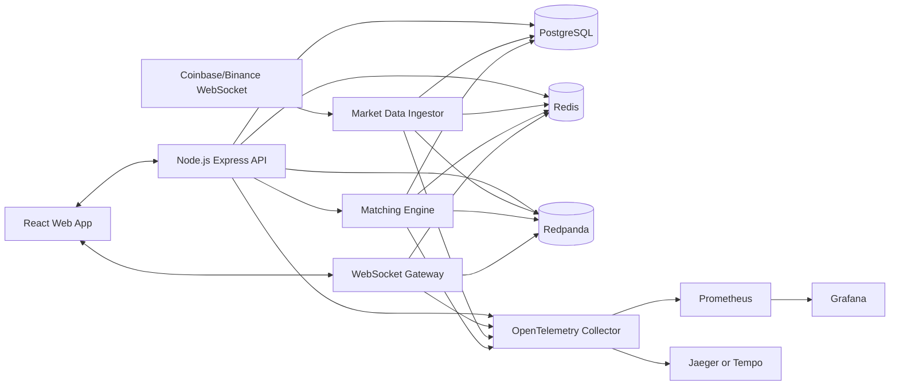
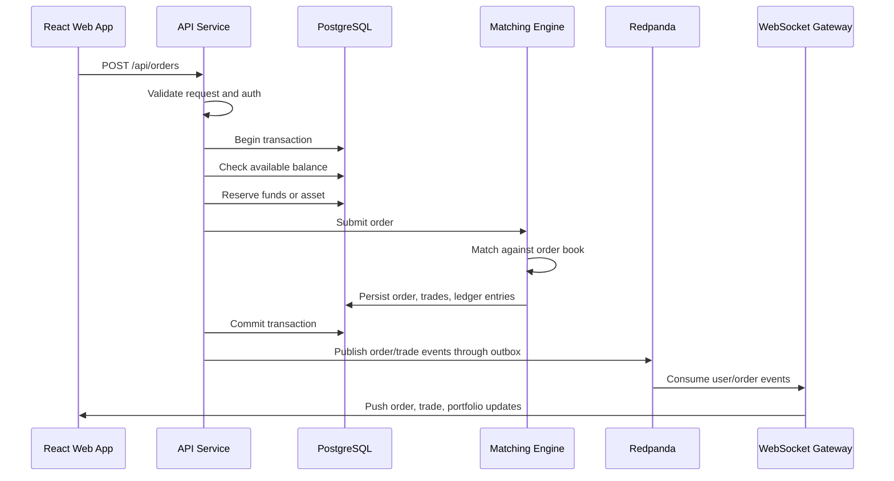

# ARCHITECTURE.md

## Overview

The platform is a local-first, event-driven paper trading system. It uses live public crypto market data, a custom matching engine, PostgreSQL for durable business state, Redis for real-time coordination, Redpanda for Kafka-compatible event streaming, and OpenTelemetry for traces and metrics.

The goal is to look and behave like a production system while remaining free to run locally.

## High-Level Diagram



## Proposed Repository Structure

```txt
.
|-- apps
|   |-- api
|   |   |-- src
|   |   |   |-- modules
|   |   |   |   |-- auth
|   |   |   |   |-- market-data
|   |   |   |   |-- orders
|   |   |   |   |-- portfolio
|   |   |   |   |-- users
|   |   |   |   `-- websocket
|   |   |   |-- infra
|   |   |   |   |-- db
|   |   |   |   |-- redis
|   |   |   |   |-- redpanda
|   |   |   |   `-- telemetry
|   |   |   `-- main.ts
|   |   `-- test
|   `-- web
|       |-- src
|       |   |-- app
|       |   |-- components
|       |   |-- features
|       |   |-- lib
|       |   `-- stores
|       `-- test
|-- packages
|   |-- config
|   |-- domain
|   |-- eslint-config
|   |-- test-utils
|   `-- tsconfig
|-- infra
|   |-- docker
|   |-- grafana
|   |-- prometheus
|   `-- redpanda
|-- docs
|   |-- adr
|   |-- benchmarks.md
|   |-- code-review.md
|   `-- runbooks
|-- scripts
|-- SPEC.md
|-- ARCHITECTURE.md
`-- README.md
```

## Technology Choices

### Frontend

- React with TypeScript.
- Next.js or Vite can be used. For a pure trading dashboard, Vite is simpler. For routing and server-rendered pages, Next.js is stronger.
- Tailwind CSS for styling.
- TanStack Query for server state.
- Zustand for local UI state.
- React Hook Form plus Zod for forms.
- TradingView Lightweight Charts or Recharts for charting.

### Backend

- Node.js with TypeScript.
- Express.js for the initial prototype.
- Zod for request validation.
- Prisma or Drizzle for typed PostgreSQL access.
- WebSocket library:
  - `ws` for simple low-level control
  - Socket.IO only if fallback transports or rooms become useful

### Data

- PostgreSQL for durable transactional state.
- Redis for cache, rate limiting, pub/sub, and optionally Redis Streams.
- Redpanda for Kafka-compatible event streaming without needing ZooKeeper.
- MongoDB is intentionally excluded from the initial prototype unless a clear document-store use case appears.

### Observability

- OpenTelemetry SDK in Node.js services.
- OpenTelemetry Collector.
- Prometheus for metrics.
- Grafana for dashboards.
- Jaeger or Tempo for distributed traces.
- Structured JSON logs with request IDs and correlation IDs.

### Local Infrastructure

- Docker Compose for all dependencies.
- No paid cloud dependency.
- Optional local Kubernetes later through kind or minikube.

## Services

### API Service

Responsibilities:

- REST API.
- Authentication.
- Request validation.
- Rate limiting.
- Order request acceptance.
- Portfolio queries.
- Admin queries.
- Health checks.

The API owns external HTTP contracts but should not contain matching-engine business logic directly.

### WebSocket Gateway

Responsibilities:

- Authenticated client connections.
- Public market subscriptions.
- Private user subscriptions.
- Heartbeat and disconnect handling.
- Fanout from Redis or Redpanda to browser clients.
- Backpressure and slow-client handling.

For the prototype this can run inside the API process. It should still be coded as a separate module so it can become its own service later.

### Market Data Ingestor

Responsibilities:

- Connect to Coinbase or Binance public WebSocket feed.
- Normalize tick messages.
- Publish normalized events.
- Store recent ticks.
- Update candle aggregation.
- Expose feed health.
- Reconnect with backoff.

### Matching Engine

Responsibilities:

- Maintain in-memory books by symbol.
- Match orders using price-time priority.
- Produce deterministic trade results.
- Persist accepted order state, trades, and ledger entries through transactions.
- Emit durable order and trade events.
- Rebuild books from PostgreSQL on startup.

This module is the most important backend signal in the project. Keep it small, deterministic, and heavily tested.

### Worker

Responsibilities:

- Consume outbox events.
- Retry failed events.
- Build analytics projections.
- Handle dead-letter events.
- Send non-critical notifications.

For the prototype this can also start as part of the API process, then split later.

## Request Flow: Place Limit Order



## Data Consistency Model

### System Of Record

PostgreSQL is the source of truth for:

- users
- orders
- trades
- ledger entries
- audit events
- outbox events

Redis and in-memory order books are derived state. They can be rebuilt.

### Transaction Boundaries

Order acceptance, reserve movement, trade creation, and ledger creation must happen in a database transaction.

Important invariants:

- An accepted order must have a corresponding reserve ledger entry.
- A trade must have buyer and seller ledger entries.
- A filled order must not remain open in the order book.
- A cancelled order must release unused reserved balance.

### Outbox Pattern

Business transactions write events to an `outbox_events` table inside the same transaction. A worker publishes those events to Redpanda and marks them delivered. This prevents committing database changes without publishing the related event.

## Event Topics

Initial Redpanda topics:

- `market.ticks`
- `market.candles`
- `orders.events`
- `trades.events`
- `ledger.events`
- `portfolio.events`
- `audit.events`
- `dead-letter.events`

## WebSocket Design

### Public Channels

- market ticks
- candles
- order book
- system health

### Private Channels

- user's open orders
- user's trades
- user's portfolio

### Connection Rules

- Public subscriptions can be unauthenticated.
- Private subscriptions require JWT authentication.
- Each connection receives a connection ID.
- Each message includes a type, payload, timestamp, and correlation ID where relevant.
- Server sends ping messages on an interval.
- Server closes idle or unhealthy connections.

## Database Sketch

### `orders`

- `id`
- `user_id`
- `symbol`
- `side`
- `type`
- `status`
- `price`
- `quantity`
- `filled_quantity`
- `created_at`
- `updated_at`

### `trades`

- `id`
- `symbol`
- `buy_order_id`
- `sell_order_id`
- `buyer_user_id`
- `seller_user_id`
- `price`
- `quantity`
- `created_at`

### `ledger_entries`

- `id`
- `user_id`
- `asset`
- `entry_type`
- `amount`
- `order_id`
- `trade_id`
- `correlation_id`
- `created_at`

### `outbox_events`

- `id`
- `event_type`
- `aggregate_type`
- `aggregate_id`
- `payload`
- `status`
- `attempts`
- `created_at`
- `published_at`

## Caching Strategy

Redis can store:

- latest price by symbol
- order book snapshots
- short-lived market tick windows
- rate-limit counters
- WebSocket subscription metadata
- fanout messages

Do not use Redis as the source of truth for balances, orders, trades, or ledger entries.

## Tracking And Tracing

### Correlation IDs

Every external request gets a correlation ID. It must be included in:

- logs
- traces
- outbox events
- audit events
- WebSocket messages for private user updates

### Traces

Trace important paths:

- login
- order placement
- order matching
- trade settlement
- market data ingest
- WebSocket broadcast
- outbox publish

### Metrics

Minimum metrics:

- HTTP request count, duration, status code
- WebSocket active connections
- WebSocket messages sent
- market ticks received
- market feed reconnect count
- orders accepted/rejected
- trades created
- order placement latency
- matching engine latency
- outbox publish lag
- Redis and PostgreSQL operation latency

### Logs

Use structured JSON logs. Log at:

- `info` for service lifecycle and important business events
- `warn` for retries, provider reconnects, slow consumers
- `error` for failed requests, failed persistence, failed event publication

Do not log passwords, tokens, or secrets.

## Error Handling

- External APIs return typed error bodies.
- Validation errors return field-level details.
- Auth errors do not reveal whether an email exists.
- Order rejection returns a user-actionable reason.
- Internal errors include correlation IDs.
- Async failures are retried and then sent to a dead-letter topic/table.

## Security Architecture

- JWT access tokens are short-lived.
- Refresh tokens are hashed in storage.
- Auth middleware protects private routes and channels.
- API validates all input with Zod.
- Passwords are hashed with Argon2 or bcrypt.
- Rate limiting uses Redis.
- Secrets are loaded from environment variables.
- `.env` is never committed.

## Testing Strategy

### Unit Tests

- matching engine
- order state transitions
- ledger calculations
- request validators
- market data normalizers

### Integration Tests

- auth flow
- order placement
- cancellation and reserve release
- trade settlement
- PostgreSQL transaction rollback
- Redis rate limit behavior

### End-To-End Tests

- login
- view live market
- place order
- see order update through WebSocket
- view portfolio change

### Load Tests

- REST order placement with k6.
- WebSocket subscription fanout.
- Market data ingest under bursty input.

## Code Review Checklist

- Does the change preserve trading invariants?
- Are database writes transactionally safe?
- Are external inputs validated?
- Are errors actionable?
- Are private paths authenticated?
- Are logs free of secrets?
- Are tests added or updated?
- Are metrics/traces added for important backend paths?
- Is the change small enough to review?
- Does the README or spec need an update?

## Quality Gates

Local checks should run before commit:

```bash
npm run lint
npm run typecheck
npm run test
```

Recommended Git hooks:

- Husky for pre-commit and commit-msg hooks.
- lint-staged for formatting and linting changed files.
- commitlint for conventional commit messages.

CI checks on pull requests:

```bash
npm ci
npm run lint
npm run typecheck
npm run test
npm run build
```

For major milestones:

```bash
npm run test:e2e
npm run test:load
```

## Deployment Model

### Prototype

Run everything locally:

```bash
docker compose up --build
```

### Optional Future Free Demo

- Frontend on a free static hosting tier.
- Backend not required to be publicly deployed.
- A recorded demo video and screenshots are acceptable for CV/GitHub.

### Optional Future Production-Like Path

- Containerize API, web, worker, and ingestor.
- Add Kubernetes manifests or Helm chart.
- Add Terraform examples as documentation only.
- Keep cloud deployment optional so the zero-cost goal remains intact.

## Architecture Decision Records

Document important decisions in `docs/adr`.

Initial ADRs to create:

- PostgreSQL as system of record.
- Redis for cache and real-time coordination.
- Redpanda for Kafka-compatible local event streaming.
- MongoDB excluded from initial prototype.
- Outbox pattern for durable event publishing.
- Paper trading only, no real money.
