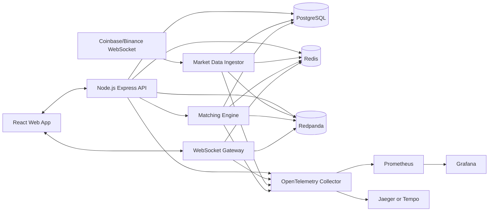

# Real-Time Crypto Trading Platform

A zero-cost, production-style paper trading platform built to demonstrate backend and full-stack engineering depth: live crypto market data, WebSocket updates, a custom matching engine, PostgreSQL ledger storage, event streaming, observability, tests, and local infrastructure.

This project is designed for portfolio and CV impact. It is not a real-money exchange.

## Why This Project Exists

Common portfolio projects often stop at CRUD, authentication, and basic dashboards. This project targets harder engineering signals:

- real-time market data ingestion
- order book and matching-engine logic
- database-backed trading ledger
- WebSocket fanout
- event-driven architecture
- observability with metrics and traces
- local infrastructure with Docker Compose
- testable, reviewable TypeScript code

## Core Features

- User registration and login.
- Paper-trading balances.
- Live crypto market data from free public WebSocket providers.
- BTC/ETH trading prototype.
- Limit and market orders.
- Price-time-priority matching engine.
- Buy/sell order book.
- Trade history.
- Append-only ledger.
- Portfolio view.
- Real-time WebSocket updates.
- Admin/dev health dashboard.
- Rate limiting.
- Audit log.
- OpenTelemetry tracing.
- Prometheus metrics.
- Grafana dashboards.
- k6 load tests.
- GitHub Actions CI.
- Husky, lint-staged, and commitlint checks.

## Tech Stack

### Frontend

- React
- TypeScript
- Tailwind CSS
- TanStack Query
- Zustand
- React Hook Form
- Zod
- TradingView Lightweight Charts or Recharts

### Backend

- Node.js
- TypeScript
- Express.js
- WebSocket with `ws`
- Zod validation
- Prisma or Drizzle ORM
- JWT authentication
- Argon2 or bcrypt password hashing

### Data And Infrastructure

- PostgreSQL as primary database
- Redis for cache, rate limiting, and pub/sub
- Redpanda for Kafka-compatible event streaming
- Docker Compose for local infrastructure
- OpenTelemetry Collector
- Prometheus
- Grafana
- Jaeger or Tempo

### Testing And Quality

- Vitest or Jest
- Supertest
- Playwright
- Testcontainers
- k6
- ESLint
- Prettier
- Husky
- lint-staged
- commitlint
- GitHub Actions

## Zero-Cost Rule

The project must run locally without paid services.

Use:

- free public crypto market WebSocket data
- local PostgreSQL container
- local Redis container
- local Redpanda container
- local observability containers
- GitHub public repository
- GitHub Actions free allowance for public repos

Avoid:

- paid cloud databases
- paid object storage
- paid stock-market APIs
- paid deployment requirements
- real-money trading features

## Current Status

This repository is in the Week 1 foundation milestone. Implemented today:

- npm workspaces for API, web, and shared domain package.
- Express API with health, symbols, system info, request logging, and correlation IDs.
- WebSocket skeleton at `/ws`.
- React/Vite dashboard shell with fixture market data and explicit paper-trading status.
- Docker Compose for PostgreSQL, Redis, Redpanda, Prometheus, Grafana, and Jaeger.
- CI workflow running lint, typecheck, tests, and build.
- Architecture decision records and runbook skeletons under `docs/`.

Not implemented yet: auth, database migrations, live market ingestion, real order placement,
matching, ledger settlement, outbox workers, and production observability dashboards.

## Local Environment

Required tools:

- Node.js current LTS
- npm
- Docker Desktop or compatible Docker engine
- Git

Recommended tools:

- TablePlus, DBeaver, or pgAdmin for database inspection
- Postman, Insomnia, or Bruno for API testing
- VS Code with ESLint and Prettier extensions

## Current Commands

Install dependencies and create a local environment file:

```bash
npm install
cp .env.example .env
```

Start infrastructure:

```bash
docker compose up -d
```

Start the API and web app in separate terminals:

```bash
npm run dev:api
npm run dev:web
```

Local URLs:

- API: `http://localhost:4000`
- Web: `http://127.0.0.1:5173`
- WebSocket: `ws://localhost:4000/ws`
- Prometheus: `http://localhost:9090`
- Grafana: `http://localhost:3000`
- Jaeger: `http://localhost:16686`

Quality checks:

```bash
npm run lint
npm run typecheck
npm run test
npm run build
```

Major milestone checks:

```bash
npm run test:e2e
npm run test:load
```

These e2e and load-test scripts are planned but not implemented yet.

## Architecture



## Database Direction

PostgreSQL is the system of record for:

- users
- sessions
- orders
- trades
- ledger entries
- audit events
- outbox events

Redis is used only for derived or short-lived state:

- latest prices
- rate limits
- WebSocket fanout
- cached order book snapshots

MongoDB is not part of the initial prototype. It can be added later only if a clear document-store use case appears.

## Observability

The project should include:

- request IDs
- correlation IDs
- structured JSON logs
- OpenTelemetry traces
- HTTP latency metrics
- WebSocket connection metrics
- order placement latency
- matching engine latency
- market feed reconnect count
- outbox publish lag
- Grafana dashboard screenshots

## Code Quality Gates

Before commit:

```bash
npm run lint
npm run typecheck
npm run test
```

Recommended hooks:

- Husky `pre-commit`
- lint-staged for changed files
- commitlint for commit messages

Example pre-commit checks:

```bash
npm run lint-staged
npm run typecheck
npm run test -- --runInBand
```

Pull requests should include:

- description of behavior changed
- screenshots for UI changes
- test evidence
- migration notes if database schema changed
- observability impact if backend paths changed

## Project Milestones

1. Foundation: monorepo, TypeScript, Docker Compose, CI, linting, testing.
2. Auth and portfolio: registration, login, seeded demo balances.
3. Market data: live provider feed, normalized ticks, frontend chart.
4. Matching engine: limit orders, market orders, order book, tests.
5. Real-time trading: WebSocket updates, order/trade/portfolio events.
6. Observability: traces, metrics, dashboards, structured logs.
7. Benchmarks and polish: k6 tests, screenshots, architecture docs, CV bullets.

## CV Bullet Target

Built a real-time crypto paper-trading platform with live WebSocket market data, a custom price-time-priority matching engine, PostgreSQL ledger storage, Redis-backed real-time fanout, Redpanda event streaming, OpenTelemetry tracing, Dockerized infrastructure, and k6 benchmark results.

## Documentation

- [SPEC.md](SPEC.md) defines product scope, features, data model, milestones, and done criteria.
- [ARCHITECTURE.md](ARCHITECTURE.md) explains system design, service boundaries, database strategy, events, observability, and quality gates.
- [docs/api.md](docs/api.md) defines current API routes, response envelopes, and error standards.
- [docs/events.md](docs/events.md) defines event envelopes, topics, and outbox rules.
- [docs/data-model.md](docs/data-model.md) captures the planned Week 2 schema and invariants.
- [docs/code-review.md](docs/code-review.md) provides the review checklist.
- [docs/runbooks/local-development.md](docs/runbooks/local-development.md) describes local setup and quality commands.
- [docs/runbooks/troubleshooting.md](docs/runbooks/troubleshooting.md) covers common local failures.
- [docs/adr](docs/adr) stores accepted architecture decisions.
